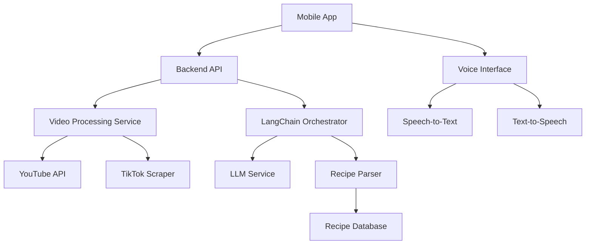

# Technical Architecture

## System Overview



## Component Details

### Mobile Application (React Native/Expo)
- **URL Input Component**: Validates and processes video URLs
- **Voice Interaction Module**: Manages speech recognition and synthesis
- **Recipe Display**: Shows current step, ingredients, and progress
- **Session Manager**: Maintains state during the cooking session
- **Error Handler**: Manages connectivity and processing issues

### Backend Services
- **API Gateway**: RESTful endpoints for mobile client communication
- **Video Processing Service**: Extracts video content and metadata
- **LangChain Orchestrator**: Manages LLM interactions and prompt engineering
- **Recipe Parser**: Structures raw text into formatted recipe steps
- **Session Service**: Maintains user session state and history

### AI Components
- **Transcription Service**: Converts video audio to text (Whisper API)
- **LLM Integration**: Processes text to extract recipe information
- **Conversation Manager**: Handles dialogue flow and context
- **Voice Agent**: Maintains persona and conversational context

## Data Flow

1. **Video URL Submission**:
   - User submits URL → Mobile App validates → Backend processes
   - Video content extracted → Transcription generated
   - LLM analyzes content → Structured recipe created

2. **Voice Interaction Flow**:
   - User speaks → Speech-to-Text converts → Intent recognized
   - LLM generates response → Text-to-Speech converts → User hears response
   - Session state updated → UI reflects current step

3. **Recipe Progression**:
   - Voice agent presents step → User acknowledges completion
   - Next step loaded → Voice agent describes → Process repeats
   - Final step completed → Session summary provided

## Technical Implementation

### Frontend (React Native/Expo)
```typescript
// Key components structure
- app/
  - screens/
    - HomeScreen.tsx       // URL input and session start
    - CookingScreen.tsx    // Active cooking session UI
    - RecipeScreen.tsx     // Recipe overview
  - components/
    - VoiceInterface.tsx   // Voice interaction component
    - RecipeStep.tsx       // Individual step display
    - UrlInput.tsx         // URL validation and submission
  - services/
    - api.ts               // Backend API communication
    - voice.ts             // Voice recognition and synthesis
    - session.ts           // Session state management
```

### Backend (Node.js)
```typescript
// Key services structure
- src/
  - api/
    - routes.ts            // API endpoints
    - controllers.ts       // Request handlers
  - services/
    - video-processor.ts   // Video content extraction
    - langchain-service.ts // LLM orchestration
    - recipe-parser.ts     // Recipe structuring
  - models/
    - recipe.ts            // Recipe data model
    - session.ts           // Session data model
  - utils/
    - prompts.ts           // LLM prompt templates
    - validators.ts        // Input validation
```

### LangChain Implementation
```typescript
// Example LangChain recipe extraction
import { ChatOpenAI } from "langchain/chat_models/openai";
import { PromptTemplate } from "langchain/prompts";
import { LLMChain } from "langchain/chains";

const recipeExtractionPrompt = PromptTemplate.fromTemplate(`
Extract a structured recipe from the following video transcript:
{transcript}

Format the response as JSON with the following structure:
{
  "title": "Recipe title",
  "ingredients": ["ingredient 1", "ingredient 2", ...],
  "steps": ["step 1", "step 2", ...],
  "cookingTime": "estimated time",
  "servings": "number of servings"
}
`);

const llm = new ChatOpenAI({ temperature: 0.2 });
const recipeChain = new LLMChain({ llm, prompt: recipeExtractionPrompt });

// Usage
const result = await recipeChain.call({ transcript: videoTranscript });
```

## API Endpoints

| Endpoint | Method | Description |
|----------|--------|-------------|
| `/api/videos/process` | POST | Submit video URL for processing |
| `/api/recipes/{id}` | GET | Retrieve processed recipe |
| `/api/sessions/start` | POST | Initialize cooking session |
| `/api/sessions/{id}/next` | GET | Get next recipe step |
| `/api/query` | POST | Submit user voice query |

## Security Considerations
- API rate limiting for video processing
- User authentication for session persistence
- Secure storage of API keys
- Input validation for all user-submitted content

## Performance Optimization
- LLM response caching
- Incremental recipe loading
- Voice recognition optimization
- Background processing for video content 